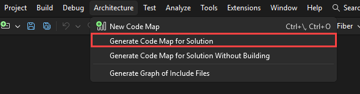
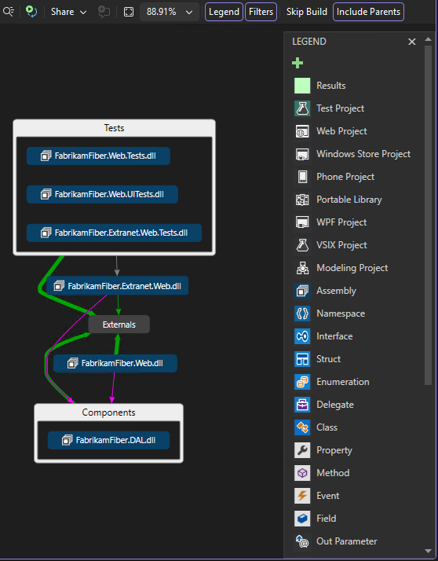
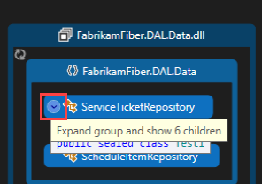
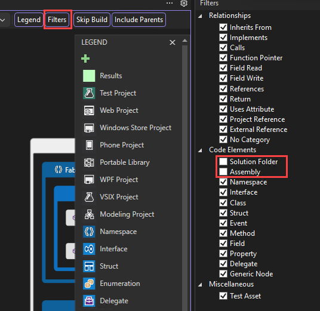
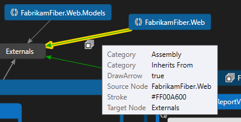
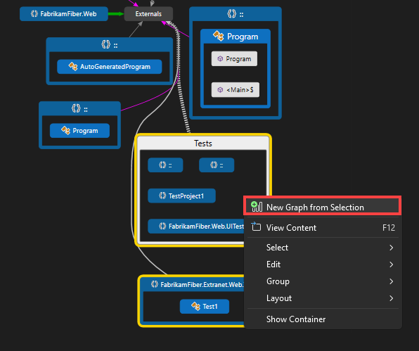
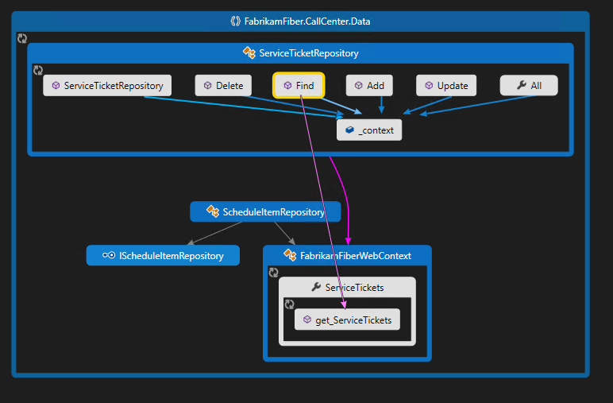
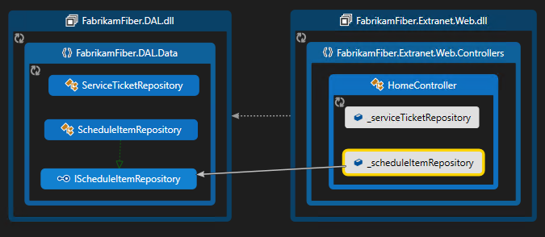
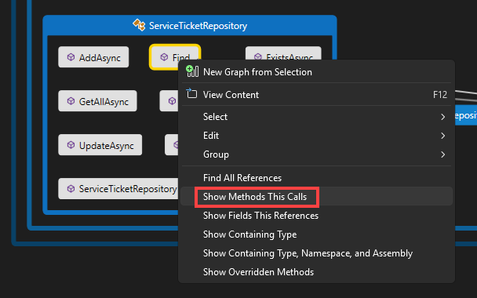

# Map dependencies with code maps

In this article, you'll learn how to visualize dependencies across your code with code maps.

## What are code maps?

In Visual Studio, code maps help you more quickly see how your program code fits together without reading through files and lines of code.  With these maps, you can see the organization and relationships in your code, including its structure and its dependencies, how to update it, and estimate the cost of proposed changes.

:::image type="content" source="../modeling/media/visualstudio/code-maps-main-intro.png" alt-text="Screenshot that shows how to view dependencies with code maps in Visual Studio." lightbox="../modeling/media/visualstudio/code-maps-main-intro.png":::

You can map dependencies for code in these languages:

- Visual C# or Visual Basic in a solution or assemblies (*.dll* or *.exe*)

- Native or managed C or C++ code in Visual C++ projects, header files (*.h* or `#include`), or binaries

- X++ projects and assemblies made from .NET modules for Microsoft Dynamics AX

> [!NOTE]
> For projects other than C# or Visual Basic, there are fewer options for starting a code map or adding items to an existing code map. For example, you cannot right-click an object in the text editor of a C++ project and add it to a code map. However, you can drag and drop individual code elements or files from **Solution Explorer**, **Class View**, and **Object Browser**.

## Prerequisites

To create a code map in Visual Studio, first [install the **Code Map** and **Live Dependency Validation** components](install-architecture-tools.md)

To create and edit code maps, you need **Visual Studio Enterprise edition**. However, in Visual Studio Community and Professional editions, you can open diagrams that were generated in Enterprise edition, but you cannot edit them.

> [!NOTE]
> Before you share maps created in Visual Studio Enterprise with others who use Visual Studio Professional, make sure that all the items on the map (such as hidden items, expanded groups, and cross-group links) are visible.

## Add a code map

You can create an empty code map and drag items onto it, including assembly references, files and folders, or you can generate a code map for all or part of your solution.

To add an empty code map:

1. In **Solution Explorer**, open the shortcut menu for your top-level solution node. Choose **Add** > **New Item**.

2. In the **Add New Item** dialog, under **Installed**, choose the **General** category.

3. Choose the **Directed Graph Document(.dgml)** template and then select **Add**.

   > [!TIP]
   > This template may not appear alphabetically, so scroll down to the bottom of the template list if you don't see it.

   A blank map appears in your solution's **Solution Items** folder.

Similarly, you can create a new code map file without adding it to your solution by selecting **Architecture** > **New Code Map** or **File** > **New** > **File**.

Learn more:
- [Share code maps](share-code-maps.md)
- [Create code maps for C++](code-maps-for-cpp.md)
- [Improve code map performance](code-maps-performance.md)

## Generate a code map for your solution

To see all the dependencies in your solution:

1. On the menu bar, choose **Architecture** > **Generate Code Map for Solution**. If your code hasn't changed since the last time you built it, you can select **Architecture** > **Generate Code Map for Solution Without Building** instead.

   

   A map is generated that shows the top-level assemblies and aggregated links between them. The wider the aggregate link, the more dependencies it represents.

2. Use the **Legend** button on the code map toolbar to show or hide the list of project type icons (such as Test, Web, and Phone Project), code items (such as Classes, Methods, and Properties), and relation types (such as Inherits From, Implements, and Calls).

   

   This example solution contains Solution Folders (**Tests** and **Components**), Test Projects, Web Projects, and assemblies. By default, all containment relationships appear as *groups*, which you can expand and collapse. The **Externals** group contains anything outside your solution, including platform dependencies. External assemblies show only those items that are used. By default, system base types are hidden on the map to reduce clutter.

3. To drill down into the map, expand the groups that represent projects and assemblies. You can expand everything by pressing **CTRL+A** to select all the nodes and then choosing **Group**, **Expand** from the shortcut menu.

   :::image type="content" source="../modeling/media/visualstudio/code-maps-expand-all-groups.png" alt-text="Screenshot that shows all groups expanded in a code map." lightbox="../modeling/media/visualstudio/code-maps-expand-all-groups.png":::

4. However, this may not be useful for a large solution. In fact, for complex solutions, memory limitations may prevent you from expanding all the groups. Instead, to see inside an individual node, expand it. Move your mouse pointer on top of the node and then click the chevron (down arrow) when it appears.

   

   Or use the keyboard by selecting the item then pressing the plus key (**+**). To explore deeper levels of code, do the same for namespaces, types, and members.

   > [!TIP]
   > For more details about working with code maps using the mouse, keyboard, and touch, see [Browse and rearrange code maps](../modeling/browse-and-rearrange-code-maps.md).

5. To simplify the map and focus on individual parts, choose **Filters** on the code map toolbar and select just the types of nodes and links you are interested in. For example, you can hide all the Solution Folder and Assembly containers.

   

   You can also simplify the map by hiding or removing individual groups and items from the map, without affecting the underlying solution code.

6. To see the relationships between items, select them in the map. The colors of the links indicate the types of relationship, as shown in the **Legend** pane.

   :::image type="content" source="../modeling/media/visualstudio/code-maps-main-intro.png" alt-text="Screenshot that shows how to view dependencies across solutions." lightbox="../modeling/media/visualstudio/code-maps-main-intro.png":::

   In this example, the purple links are calls, the dotted links are references, and the light blue links are field access. Green links can be inheritance, or they may be *aggregate links* that indicate more than one type of relationship (or *category*).

   > [!TIP]
   > If you see a green link, it might not mean there's just an inheritance relationship. There might also be method calls, but these are hidden by the inheritance relationship. To see specific types of links, use the checkboxes in the **Filters** pane to hide the types you aren't interested in.

7. To get more information about an item or link, move the pointer on top of it until a tooltip appears. This shows details of a code element or the categories that a link represents.

   

8. To examine items and dependencies represented by an aggregate link, first select the link and then open its shortcut menu. Choose **Show Contributing Links** (or **Show Contributing Links on New Code Map**). This expands the groups at both ends of the link and shows only those items and dependencies that participate in the link.

9. To focus in on specific parts of the map, you can continue to remove items you aren't interested in. For example, to drill into class and member view, simply filter all the namespace nodes in the **Filters** pane.

   :::image type="content" source="../modeling/media/visualstudio/dependency-graph-expanded-selected-groups.png" alt-text="Screenshot that shows how to drill down to class and member level." lightbox="../modeling/media/visualstudio/dependency-graph-expanded-selected-groups.png":::

10. Another way to focus in on a complex solution map is to generate a new map containing selected items from an existing map. Hold **Ctrl** while selecting the items you want to focus on, open the shortcut menu, and choose **New Graph from Selection**.

    

11. The containing context is carried over to the new map. Hide Solution Folders and any other containers you don't want to see using the **Filters** pane.

    :::image type="content" source="../modeling/media/visualstudio/code-maps-expand-new-groups.png" alt-text="Screenshot that shows how to filter containers to simplify the view." lightbox="../modeling/media/visualstudio/code-maps-expand-new-groups.png":::

12. Expand the groups and select items in the map to view the relationships.

    :::image type="content" source="../modeling/media/visualstudio/code-maps-view-new-relationships.png" alt-text="Screenshot that shows selecting items to view the relationships." lightbox="../modeling/media/visualstudio/code-maps-view-new-relationships.png":::

Also see:

- [Browse and rearrange code maps](../modeling/browse-and-rearrange-code-maps.md)
- [Customize code maps by editing the DGML files](../modeling/customize-code-maps-by-editing-the-dgml-files.md)
- Find potential problems in your code by [running an analyzer](../modeling/find-potential-problems-using-code-map-analyzers.md)

## View dependencies

Suppose you have a code review to perform in some files with pending changes. To see the dependencies in those changes, you can create a code map from those files.

   

1. Drag items from **Solution Explorer**, **Class View**, or **Object Browser** into a [new](#add-a-code-map) or existing code map. To include the parent hierarchy for your items, press and hold the **Ctrl** key while you drag items, or use the **Include Parents** button on the code map toolbar to specify the default action. You can also drag assembly files from outside Visual Studio, such as from **Windows Explorer**.

   > [!NOTE]
   > When you add items from a project that's shared across multiple apps, like Windows Phone or Microsoft Store, those items appear on the map with the currently active app project. If you change context to another app project and add more items from the shared project, those items now appear with the newly active app project. Operations that you perform with an item on the map apply only to those items that share the same context.

1. The map shows the selected items within their containing assemblies.

   

1. To explore items, expand them. Move the mouse pointer on top of an item, then click the chevron (down arrow) icon when it appears.

   

   To expand all items, select them using **Ctrl**+**A**, then open the shortcut menu for the map and choose **Group** > **Expand**. However, this option isn't available if expanding all groups creates an unusable map or memory issues.

1. Continue to expand items you are interested in, right down to the class and member level if necessary.

   :::image type="content" source="../modeling/media/visualstudio/code-maps-expand-to-class-and-member.png" alt-text="Screenshot that shows groups expanded to the class and member level." lightbox="../modeling/media/visualstudio/code-maps-expand-to-class-and-member.png":::

   To see members that are in the code but don't appear on the map, click the **Refetch Children** icon  in the top left corner of a group.

1. To see more items related to those on the map, select one and choose **Show Related** on the code map toolbar, then select the type of related items to add to the map. Alternatively, select one or more items, open the shortcut menu, and then choose the **Show** option for the type of related items to add to the map. For example:

    For an **assembly**, choose:

    |Option|Description|
    |-|-|
    |**Show Assemblies This References**|Add assemblies that this assembly references. External assemblies appear in the **Externals** group.|
    |**Show Assemblies Referencing This**|Add assemblies in the solution that reference this assembly.|

    For a **namespace**, choose **Show Containing Assembly**, if it's not visible.

    For a **class** or **interface**, choose:

    |Option|Description|
    |-|-|
    |**Show Base Types**|For a class, add the base class and the implemented interfaces.   For an interface, add the base interfaces.|
    |**Show Derived Types**|For a class, add the derived classes.   For an interface, add the derived interfaces and the implementing classes or structs.|
    |**Show Types This References**|Add all classes and their members that this class uses.|
    |**Show Types Referencing This**|Add all classes and their members that use this class.|
    |**Show Containing Namespace**|Add the parent namespace.|
    |**Show Containing Namespace and Assembly**|Add the parent container hierarchy.|
    |**Show All Base Types**|Add the base class or interface hierarchy recursively.|
    |**Show All Derived Types**|For a class, add all the derived classes recursively.   For an interface, add all the derived interfaces and implementing classes or structs recursively.|

     For a **method**, choose:

    |Option|Description|
    |-|-|
    |**Show Methods This Calls**|Add methods that this method calls.|
    |**Show Fields This References**|Add fields that this method references.|
    |**Show Containing Type**|Add the parent type.|
    |**Show Containing Type, Namespace, and Assembly**|Add the parent container hierarchy.|
    |**Show Overridden Methods**|For a method that overrides other methods or implements an interface's method, add all the abstract or virtual methods in base classes that are overridden and, if any, the interface's method that is implemented.|

     For a **field** or **property**, choose:

    |Option|Description|
    |-|-|
    |**Show Containing Type**|Add the parent type.|
    |**Show Containing Type, Namespace, and Assembly**|Add the parent container hierarchy.|

    

1. The map shows the relationships. In this example, the map shows the methods called by the `Find` method and their location in the solution or externally.

   :::image type="content" source="../modeling/media/visualstudio/specific-dependencies.png" alt-text="Screenshot that shows specific dependencies on a code map." lightbox="../modeling/media/visualstudio/specific-dependencies.png":::

1. To simplify the map and focus on individual parts, choose **Filters** on the code map toolbar and select just the types of nodes and links you are interested in. For example, turn off display of Solution Folders, Assemblies, and Namespaces.

   :::image type="content" source="../modeling/media/visualstudio/code-map-filter-pane.png" alt-text="Screenshot that shows the Filter options for simplifying the display." lightbox="../modeling/media/visualstudio/code-map-filter-pane.png":::

## Related content

- [Share code maps](share-code-maps.md)
- [Create code maps for C++](code-maps-for-cpp.md)
- [Improve code map performance](code-maps-performance.md)
- [Use code maps to debug your applications](../modeling/use-code-maps-to-debug-your-applications.md)
- [Map methods on the call stack while debugging](../debugger/map-methods-on-the-call-stack-while-debugging-in-visual-studio.md)
- [Find potential problems using code map analyzers](../modeling/find-potential-problems-using-code-map-analyzers.md)
- [Browse and rearrange code maps](../modeling/browse-and-rearrange-code-maps.md)
- [Customize code maps by editing the DGML files](../modeling/customize-code-maps-by-editing-the-dgml-files.md)
