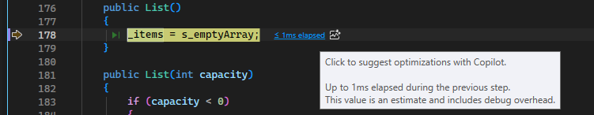

# PerfTips

Visual Studio debugger *PerfTips* and the debugger-integrated **Diagnostic Tools** help you to monitor and analyze the performance of your app while you are debugging.

Although the debugger-integrated diagnostic tools are a great way of becoming aware of performance issues while you are developing, the debugger can have a significant impact on the performance of your app. To collect more accurate performance data, consider using the tools in the Performance Profiler as an additional part of your performance investigations. See [Run profiling tools on release or debug builds](../profiling/running-profiling-tools-with-or-without-the-debugger.md).

## PerfTips

When the debugger stops execution at a breakpoint or stepping operation, the elapsed time between the break and the previous breakpoint appears as a tip in the editor window. For more information, see [PerfTips: Performance Information at-a-glance while Debugging with Visual Studio](https://devblogs.microsoft.com/devops/perftips-performance-information-at-a-glance-while-debugging-with-visual-studio/).

## Diagnostics Tools window

Breakpoints and associated timing data gets recorded in the **Diagnostic Tools** window.

The following illustration shows the **Diagnostic Tools** window.

- The **Break Events** timeline mark the breakpoints that were hit in the debugging session. Click on an event to select it the **Debugger** details list.

- The **CPU Utilization** graph shows the change in CPU use across all processor cores in the debugging session.

- The **Events** list of the **Debugger** details pane include items for each break event.

- The **Duration** column of a break event displays the elapsed time between the event and the previous breakpoint.

::: moniker range=">= visualstudio"

## Get AI-powered optimization suggestions from PerfTips

In Visual Studio 2026 version 18.4 and later, PerfTips integrate with the Copilot Profiler Agent to provide AI-driven performance analysis during debugging.

When the debugger pauses at a breakpoint or after a step operation, the PerfTip displays elapsed time along with additional performance signals. Click the PerfTip to ask Copilot for optimization suggestions. The Profiler Agent captures runtime data—including elapsed time, CPU usage, and memory allocations—and uses Copilot to pinpoint performance hot spots and suggest targeted code fixes.

### Prerequisites

- Visual Studio 2026 version 18.4 or later.
- A [GitHub account with Copilot access](https://docs.github.com/en/copilot/about-github-copilot/what-is-github-copilot#getting-access-to-copilot) signed in to Visual Studio.

### Use the Profiler Agent from a PerfTip

1. Set a breakpoint and start debugging your application.
1. When the debugger pauses, observe the PerfTip that appears in the editor showing elapsed time.
1. Click the PerfTip to open a Copilot prompt with performance context.
1. The Profiler Agent analyzes the captured runtime data and provides optimization suggestions.

For a full tutorial on the Profiler Agent, see [Profile your app with GitHub Copilot Profiler Agent](profile-with-copilot-agent.md).

::: moniker-end

## Turn PerfTips on or off

To enable or disable PerfTips:

1. On the **Debug** menu, choose **Options**.

2. Check or clear **Show elapsed PerfTip while debugging**.

## Turn the Diagnostic Tools window on or off

To enable or disable the Diagnostic Tools window:

1. On the **Debug** menu, choose **Options**.

2. Check or clear **Enable Diagnostics Tools while debugging**.

## Related content

- [Profiling in Visual Studio](../profiling/index.yml)
- [First look at profiling tools](../profiling/profiling-feature-tour.md)
- [Profile your app with GitHub Copilot Profiler Agent](../profiling/profile-with-copilot-agent.md)
- [Identify hot paths with Flame Graph](../profiling/flame-graph.md)
- [Analyze performance by using CPU profiling](../profiling/cpu-usage.md)
