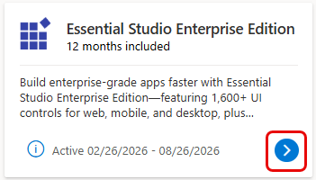
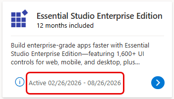

# Syncfusion benefits in Visual Studio Subscriptions

## Overview

Visual Studio Subscribers receive access to select Syncfusion benefits at no extra cost. These benefits include time-limited access to UI components and document solutions, API-based document signing with included usage, and analytics tools for dashboards and reports. Dev Essentials members receive extra benefits. Each benefit must be activated individually through the [Visual Studio Subscriptions portal](https://www.MyVisualStudio.com/Benefits).

## Benefits for Visual Studio Subscribers

**Essential Studio Enterprise Edition** provides access to the UI Component Suite for web, desktop, and mobile development, plus Document SDK for PDF, Word, Excel, and PowerPoint. This benefit is available for 12 months from activation.

**BoldSign – eSignature API** provides access to an eSignature service that includes 50 API document credits. This benefit is available for 12 months from activation.

**Bold BI** provides access to an analytics platform, with interactive dashboards and reports. This benefit is available for six months from activation. 

## Benefits for Dev Essentials members

**Essential Studio UI Edition** provides access to the UI Component Suite for web, desktop, and mobile development. This benefit is available for six months from activation.

**Syncfusion Succinctly Series** provides access to a digital library of concise eBooks covering software development topics. Unlimited access is included as part of a Dev Essentials membership.

Use the Benefit Eligibility table to see which Syncfusion benefits are available with select Visual Studio Subscriptions. 

## Benefit Eligibility

| **Benefit** | **Subscription Level** | **Channel** | **Benefit Duration** | **Renewable?** |
| ----------- | ---------------------- | ----------- | -------------------- | -------------- |
| [Essential Studio Enterprise Edition](https://www.syncfusion.com/vs-subscribers-esee-offer) | Visual Studio Enterprise (Standard)  Visual Studio Professional (Standard)  Visual Studio Enterprise Subscription with GitHub Enterprise  Visual Studio Professional Subscription with GitHub Enterprise | Volume Licensing (VL)  Azure  Retail | 12 months | No |
| [BoldSing - E-Signature API](https://boldsign.com/esignature-api/) | Visual Studio Enterprise (Standard)  Azure  Retail | 12 months | No |
| [Bold BI](https://www.boldbi.com/cloud-bi/) | Visual Studio Enterprise (Standard)  Visual Studio Professional (Standard)  Visual Studio Enterprise Subscription with GitHub Enterprise  Visual Studio Professional Subscription with GitHub Enterprise | Volume Licensing (VL)  Azure  Retail | Six months | No |
| Not available | Visual Studio Test Professional (Standard)  MSDN Platforms (Standard)  Visual Studio Enterprise and Professional (monthly cloud)  Visual Studio Enterprise (NFR)* | Volume Licensing (VL)  Azure  Retail | N/A | N/A |
| [Essential Studio UI Edition](https://www.syncfusion.com/vsde-esui-offer) | Dev Essentials | N/A | Six months | N/A |
| [Syncfusion Succinctly Series](https://www.syncfusion.com/succinctly-free-ebooks) | Dev Essentials | N/A | Ongoing | N/A |

* ***Includes:** Visual Studio Enterprise NFR, FTE, Most Value Partner (MVP) and Regional Director (RD), Microsoft AI Cloud Partner Program (MAICPP), Microsoft Partner Program (MPN), ISV, Bug Bounty, Microsoft Certified Trainer (MCT), Student Ambassadors, Alumni, and Xbox (NFR Basic), Azure Dev Tools for Teaching (ADTfT), Microsoft Startups, We. Comms, Open-Source Heroes.*

> [!NOTE]
> Microsoft no longer offers Visual Studio Enterprise annual and Visual Studio Professional annual subscriptions as cloud subscriptions. Current customers continue to have the same experience and ability to renew, increase, decrease, or cancel subscriptions. New customers are encouraged to go to Visual Studio pricing to explore different options to purchase Visual Studio.

Subscribers can go to [Visual Studio Subscriptions](https://my.visualstudio.com/Subscriptions?) to view the subscriptions associated with an email address. If some subscriptions aren’t visible, one or more subscriptions might be associated with a different email address. Sign in with that email address to see those subscriptions.

## How to activate Syncfusion benefits

> [!IMPORTANT]
> If you’re entitled to multiple Syncfusion benefits, you must activate each benefit separately. If you qualify for the same benefit under more than one Visual Studio Subscription, each activation requires a unique email address at the time of activation on the Syncfusion website.

## General activation steps

1. Sign in to https://my.visualstudio.com.
1. Select the Visual Studio Subscription that includes the Syncfusion benefit.

    :::image type="content" source="_img/vs-syncfusion/subscriptions-benefits-page.png" alt-text="Screenshot of the Subscription Benefits page.":::

3. Locate the eligible Syncfusion benefit tile and select **"Activate"**.

    :::image type="content" source="_img/vs-syncfusion/enterprise-benefit-tile.png" alt-text="Essential Studio Enterprise Edition benefit tile displaying the product name, 12 months included offer, and a description of 1,600+ UI controls for web, mobile, and desktop development. A blue Activate button is highlighted with a red rectangle in the lower right corner of the tile.":::

4. Complete the remaining steps on the Syncfusion website.

The steps on the Syncfusion website might vary depending on the benefit being activated.

## How activation differs by Syncfusion benefit

**Essential Studio Enterprise Edition**

*(Visual Studio Enterprise and Professional)*

1. After the user selects **"Activate"** in the Subscriber portal, they're redirected to Syncfusion’s website.

    :::image type="content" source="_img/vs-syncfusion/enterprise-activation-landing-page.png" alt-text="Screenshot of Syncfusion activation landing page with Welcome Visual Studio Subscribers heading and Activation Benefit Now button highlighted.":::

2. After the user selects the **"Activation Benefit Now"** button, they must accept Syncfusion's **Terms and Conditions**.

    :::image type="content" source="_img/vs-syncfusion/enterprise-terms-tile.png" alt-text="Screenshot of Syncfusion's Terms and Conditions highlighted":::

3. After the user accepts the Terms and Conditions, they're redirecting to the sign-in screen.
4. If an existing Syncfusion account is available, sign in. Otherwise, select **"Create an account"**.

    :::image type="content" source="_img/vs-syncfusion/enterprise-sign-in.png" alt-text="Screenshot of the Sign in screen with fields highlighted":::

5. Follow the onscreen steps to complete the activation process.

**BoldSign**

*(Visual Studio Enterprise only)*

1. After selecting **"Activate"** in the Subscriber portal, subscribers are redirected to the **BoldSign** activation page.
2. If an account doesn’t exist, create one by entering an email address and selecting region. 
3. Select the **"Start Using BoldSign"** button. This triggers a verification email with a six-digit code sent to the subscriber.

    :::image type="content" source="_img/vs-syncfusion/bold-sign-activation-page.png" alt-text="BoldSign activation page with required fields highlighted.":::

4. If BoldSign account already exists, sign in by entering the associated email address and password. A verification email with a six-digit code sent to the user’s inbox.
 
    :::image type="content" source="_img/vs-syncfusion/bold-sign-sign-in.png" alt-text="Screenshot of BoldSign sign in screen.":::

5. Enter the verification code to continue.

    :::image type="content" source="_img/vs-syncfusion/bold-sign-enter-code.png" alt-text="Screenshot of BoldSign ener 6-digit code from email":::

6. On the next screen, enter billing information in the event that more than the **50 API document credits** included in this benefit are needed.
7. Activation is complete. The BoldSign benefit is now available for use.

**Bold BI**

*(Visual Studio Enterprise and Professional)*

1. After selecting **"Activate"** in the Subscriber portal, the subscriber is redirected to the **Bold BI** activation page.
2. Sign in or create an account to continue. 
3. To create an account, complete the registration form, including entering a domain name. If an account already exists, sign in and enter a domain name to continue. 
4. Accept Terms and Conditions and continue.

    :::image type="content" source="_img/vs-syncfusion/bold-bi-activation-landing-page.png" alt-text="Screenshot of Bold BI activation landing page with the required fields highlighted":::

**Essential Studio UI Edition**

*(Dev Essentials)*

1. After selecting **"Activate"** in the Subscriber portal, the subscriber is redirected to Syncfusion’s website.
2. **Terms and Conditions** must be accepted **before activating the benefit** on their website.

    :::image type="content" source="_img/vs-syncfusion/ui-edition-activation-landing-page.png" alt-text="Screenshot of the Essential Studio UI Edition activation page wit the Activate and Terms and Conditions highlighted.":::

3. After selecting the **"Activate Benefit"** button, the user is redirected to the sign-in screen.
4. If a Syncfusion account already exists, sign in. Otherwise, select **"Create an account"**.

    :::image type="content" source="_img/vs-syncfusion/ui-edition-sign-in-page.png" alt-text="Screenshot of Essential Studio UI Edition Sign in screen highlighted.":::

5. Follow the onscreen steps to complete the activation process.

**Syncfusion Succinctly Series** for Dev Essentials doesn't require activation. However, a code is needed to access the concise list of eBook titles. From the benefits portal, locate the Syncfusion Succinctly Series tile and select the **"Get Code"** button to open the eBook library and download titles. 

## Benefit Status

For time bound benefits, after activating them in the Subscriber Benefits portal, the Syncfusion benefit tiles show the status of the benefits. The Activate button is replaced with a white arrow in a blue circle. Select the arrow to go to the Syncfusion website where Syncfusion licenses can be managed.

  > [!div class="mx-imgBorder"]
  > 

In the Subscriber Benefits portal, the Syncfusion tiles show the activation date and the end date.

  > [!div class="mx-imgBorder"]
  > 

### FAQs

**Do Syncfusion benefits renew automatically?**
No. Syncfusion benefits are time bound where applicable and don't renew automatically unless explicitly stated.

**Can I activate more than one Syncfusion benefit?**
Yes. Each benefit must be activated individually.

**Can I use Syncfusion components in production?**
Yes. Syncfusion components can be used in production during the applicable benefit period, subject to Syncfusion licensing terms.

**Where can I find more detailed information about these Syncfusion products?**
This article helps describe Syncfusion benefits available through Visual Studio Subscriptions. For detailed product capabilities, feature documentation, and product specific documents, see [Syncfusion support, documentation, and resources](#syncfusion-support-documentation-and-resources).

**Are “Not for Resale” (NFR) subscriptions eligible for Syncfusion benefits?**
No. Visual Studio Enterprise NFR subscriptions aren’t eligible for Syncfusion benefits. For more information, see the [Benefit Eligibility table](#benefit-eligibility).

**Why is a credit card required to activate the BoldSign benefit?**
The BoldSign benefit includes 50 API document credits. During activation, a credit card is required only to support usage that exceeds the included credits; the card isn’t charged at activation. If usage goes beyond the 50 included API document credits, extra document signing requests are billed at $0.75 per document.

### Syncfusion support, documentation, and resources

For general information about Syncfusion benefits available through Visual Studio Subscriptions, see [Syncfusion benefits for Visual Studio subscribers](https://www.syncfusion.com/explore/visual-studio-subscription-benefits/). Included Syncfusion benefits can be viewed in the [Subscriber portal](https://www.myvisualstudio.com/Benefits).
Use the following Syncfusion resources to access documentation, support, and product‑specific guidance for activated benefits:

**Essential Studio Enterprise Edition and Essential Studio UI Edition**

+ Support: https://support.syncfusion.com/
+ Documentation: https://help.syncfusion.com/
+ Release notes: https://help.syncfusion.com/common/essential-studio/release-notes/v32.2.3

**BoldSign – eSignature API**

+ Support: https://support.boldsign.com/
+ Documentation: https://developers.boldsign.com/api-overview/getting-started/
+ Release notes: https://developers.boldsign.com/release-notes/v4.11.0/

**Bold BI**

+ Support: https://www.boldbi.com/support/
+ Documentation: https://www.boldbi.com/resources/documentation/
+ Release notes: https://www.boldbi.com/resources/release-history/14-2/

### Next Steps

+ Activate your Syncfusion benefits in the [Visual Studio Subscriptions portal](https://www.MyVisualStudio.com/Benefits).
+ Learn more about your [Visual Studio Benefits](https://learn.microsoft.com/visualstudio/subscriptions/about-benefits).
