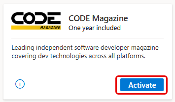
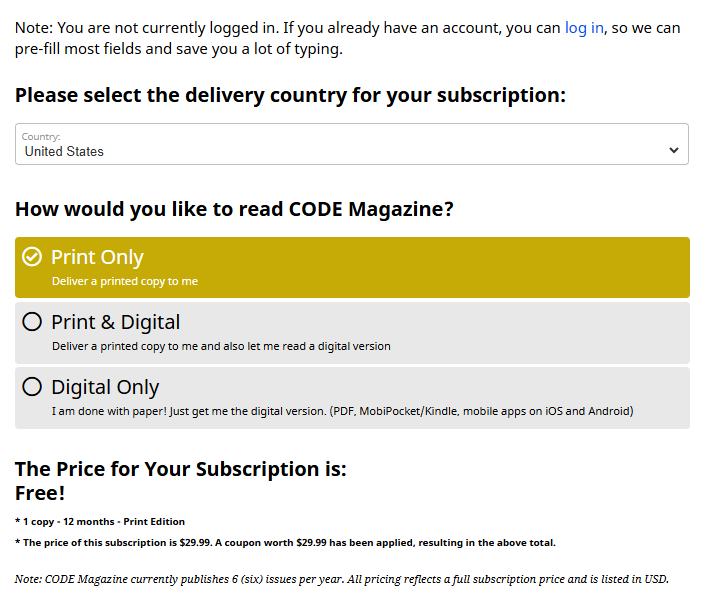
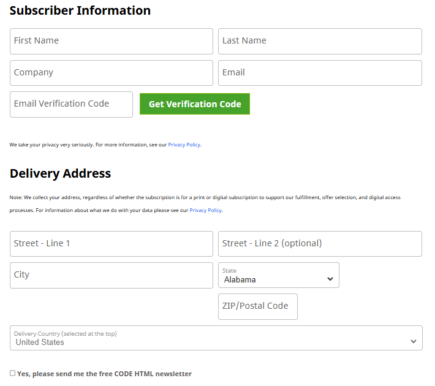

# CODE Magazine included in Visual Studio Subscriptions

CODE Magazine is a leading independent software developer magazine covering dev technologies across all platforms. Selected Visual Studio Subscriptions are eligible to receive a one-year subscription to either the printed or digital editions of the magazine.

If a subscription is eligible for the CODE Magazine benefit, the Benefit tile appears in the Benefits portal.

Not sure which subscription you’re using? Subscribers can go to [My.VisualStudio.com/Subscriptions](https://my.visualstudio.com/subscriptions) to see all Visual Studio Subscriptions assigned to their email address. If not all subscriptions appear, one or more subscriptions might be associated with a different email address. In that case, signing in with the associated email address is required to view those subscriptions.

For a complete list of subscriptions that qualify for this benefit, see the [Eligibility](#eligibility) section later in this article.

## Activation steps

The process to set up a CODE Magazine subscription is simple. Use the following steps to complete the setup:

1. Visit [https://my.visualstudio.com/benefits](https://my.visualstudio.com/benefits?wt.mc_id=o~msft~docs)
2. Locate the CODE Magazine tile in the Professional Development section of the Benefits portal, and select **Activate**.
   > [!div class="mx-imgBorder"]
   > 
3. You're redirected to the CODE Magazine landing page. Select your country/region and choose how you'd like to receive the magazine.
   > [!NOTE]
   > Dev Essentials members have access to the digital subscription only.
4. Based on your selections, you see a note showing the price of your subscription along with the amount of the coupon that was applied.
   > [!NOTE]
   > For print subscriptions:
   > - Subscribers outside the United States might incur shipping charges.
   > - Allow several weeks for the delivery of your first printed edition.
   > [!div class="mx-imgBorder"]
   > 
5. Next, you need to provide your subscriber information and a delivery address. (The delivery address is required even for digital subscriptions, as it supports fulfillment, offer selection, and digital access processes.)
6. Customers outside of the United States who chose to receive a printed magazine subscription might be asked to provide a billing address and payment information to cover the costs of shipping.
7. You can opt in to CODE HTML Newsletter by selecting the check box.
   > [!div class="mx-imgBorder"]
   > 
8. Select **Place Order** to complete your subscription.
After you complete your subscription order, you see a confirmation page, including a link you can use to see which issues you received: [https://codemag.com/my/fulfillment](https://codemag.com/my/fulfillment).

## Eligibility

| Subscription Level | Channels | Benefit | Renewable? |
| ------------------- | ---------- | -------- | ------------- |
| Visual Studio Enterprise (Standard) | VL, Azure, Retail | Available | No |
| Visual Studio Enterprise subscription with GitHub Enterprise | VL | Available | No |
| Visual Studio Professional (Standard) | VL, Azure, Retail | Available | No |
| Visual Studio Professional subscription with GitHub Enterprise | VL | Available | No |
| Visual Studio Test Professional (Standard) | VL, Retail | Not available | N/A |
| MSDN Platforms (Standard) | VL, Retail | Not available | N/A |
| Visual Studio Enterprise, Visual Studio Professional (monthly cloud) | Azure | Not available | N/A |
| Visual Studio Enterprise, Visual Studio Professional (annual cloud - See NOTE below) | Azure | Available | No |
| Visual Studio Enterprise NFR\* | NFR | Not available | N/A |

\* *Includes: Not for Resale (NFR), FTE, Microsoft AI Cloud Partner Program (MAICPP), Microsoft Partner Network (MPN), Most Valuable Professional (MVP), Regional Director (RD), MCT Software & Services Developer, Azure Dev Tools for Teaching (ADTfT), Student Ambassadors, Alumni, NFR Basic, Microsoft for Startups, We Comms, Open Source Heroes, Independent Software Vendor (ISV), Microsoft Bounty Program.*

> [!NOTE]
> Microsoft no longer offers Visual Studio Enterprise Annual subscriptions and Visual Studio Professional Annual subscriptions in Cloud Subscriptions. There will be no change to existing customers experience and ability to renew, increase, decrease, or cancel their subscriptions. New customers are encouraged to go to [https://visualstudio.microsoft.com/vs/pricing/](https://visualstudio.microsoft.com/vs/pricing/) to explore different options to purchase Visual Studio.

## Frequently asked questions

### Q: If the subscription is free, why am I being asked for a credit card?  

A: It's cost-prohibitive to send free printed copies internationally. Subscribers who choose the print edition of CODE Magazine and reside outside of the United States are charged a fee for shipping. To avoid shipping charges, choose the digital version of the magazine.

### Q: Why do I need to provide a delivery address for a digital subscription?

A:  CODE Magazine collects your address, regardless of whether the subscription is for a print or digital subscription to support fulfillment, offer selection, and digital access processes. For more information about what CODE Magazine does with your data, see their [Privacy Policy](https://www.codemag.com/Home/Privacy).

## Support resources

- Have questions about your CODE Magazine subscription? Contact [CODE Magazine](https://www.codemag.com/contact) via email or phone, or submit an online support request.
- For assistance with sales, subscriptions, accounts, and billing for Visual Studio Subscriptions, contact [Visual Studio subscriptions support](https://my.visualstudio.com/gethelp).
- Have a question about Visual Studio IDE, Azure DevOps Services, or other Visual Studio products or services? Visit [Visual Studio Support](https://visualstudio.microsoft.com/support/).

## See also

- [Visual Studio documentation](/visualstudio/)
- [Azure DevOps documentation](/azure/devops/)
- [Azure documentation](/azure/)
- [Microsoft 365 documentation](/microsoft-365/)

## Next steps

Check out the rest of the great benefits included with your subscription. Visit [https://my.visualstudio.com/benefits](https://my.visualstudio.com/benefits?wt.mc_id=o~msft~docs).

Get started using Azure. Visit [https://my.visualstudio.com/benefits](https://my.visualstudio.com/benefits?wt.mc_id=o~msft~docs) to activate your Azure DevTest individual credit benefit. Select the Azure tile in the Tools category to set up your Azure subscription and redeem your Azure DevTest individual credit.
